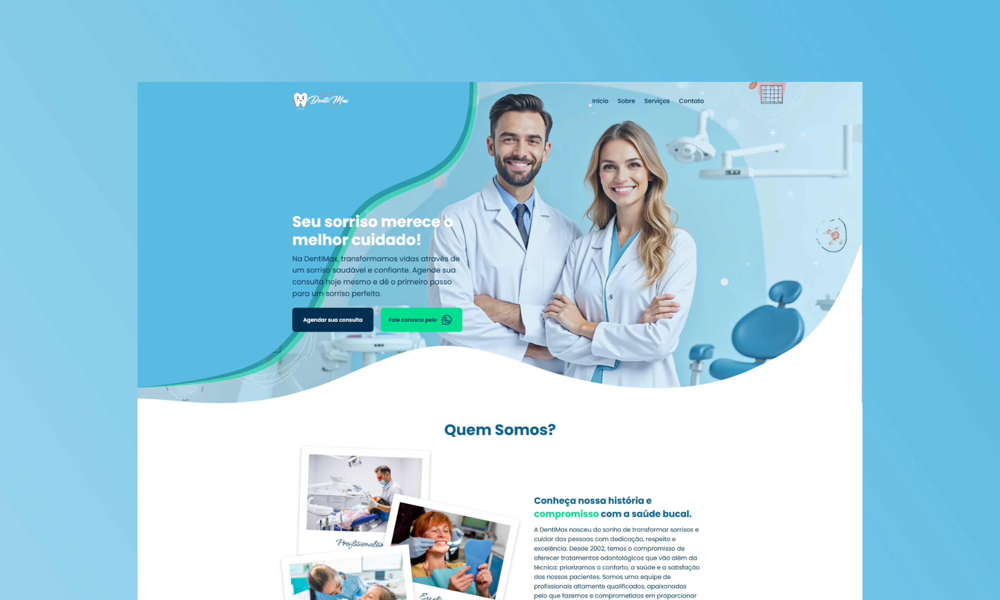

<h1 align="center" >
  Clínica Odontológica - Landing Page
</h1>

  

  

## 📌 **Visão Geral**

Esta landing page foi criada para simular o site de uma clínica odontológica fictícia chamada "DentiMax". O design moderno, limpo e focado em atrair potenciais clientes, destacando os serviços oferecidos pela clínica, depoimentos de pacientes e um formulário de contato.

## Projeto Completo

🛠 **Tecnologias Utilizada**
- HTML5: Estrutura básica da página.
- CSS3: Estilização moderna e responsiva.
- Google Fonts: Fontes "Poppins e Qwitcher Grypen" para um design limpo e profissional.

📜 **Licença**
Este projeto está sob a licença MIT . Veja o arquivo LICENSE para mais detalhes.

📧 **Contato**
Se tiver dúvidas ou sugestões, entre em contato:

- LinkedIn : [linkedin.com/in/seu-perfil](https://www.linkedin.com/in/gerson-santos-silva/)

<a href="https://landing-odonto.vercel.app/" target="_blank">Click para conferir o projeto</a>
